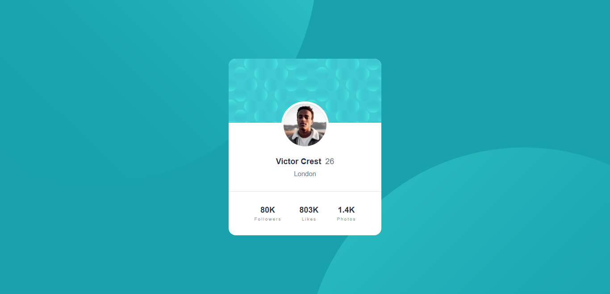
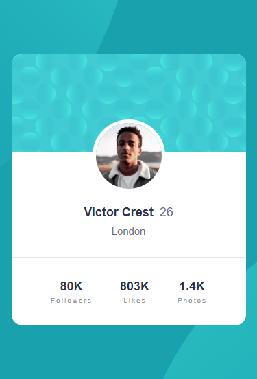

# Frontend Mentor - Profile card component solution

This is a solution to the [Profile card component challenge on Frontend Mentor](https://www.frontendmentor.io/challenges/profile-card-component-cfArpWshJ). Frontend Mentor challenges help you improve your coding skills by building realistic projects. 

## Table of contents

- [Overview](#overview)
  - [The challenge](#the-challenge)
  - [Screenshot](#screenshot)
  - [Links](#links)
- [My process](#my-process)
  - [Built with](#built-with)
  - [Useful resources](#useful-resources)
- [Author](#author)

## Overview

### The challenge

- Build out the project to the designs provided

### Screenshot

### Links

- Solution URL: [Github](https://github.com/JuanMiranda1998/profile-card-component)
- Live Site URL: [Netlify](https://juanmiranda-profile-card.netlify.app/)

## My process

### Built with

- Semantic HTML5 markup
- CSS custom properties
- Flexbox
- Mobile-first workflow

### Useful resources

- [Background patterns](https://developer.mozilla.org/en-US/docs/Web/CSS/background-position) - This helped me to set the background images.

## Author

- Frontend Mentor - [@JuanMiranda1998](https://www.frontendmentor.io/profile/JuanMiranda1998)
- Twitter - [@juan__miranda__](https://twitter.com/juan__miranda__)